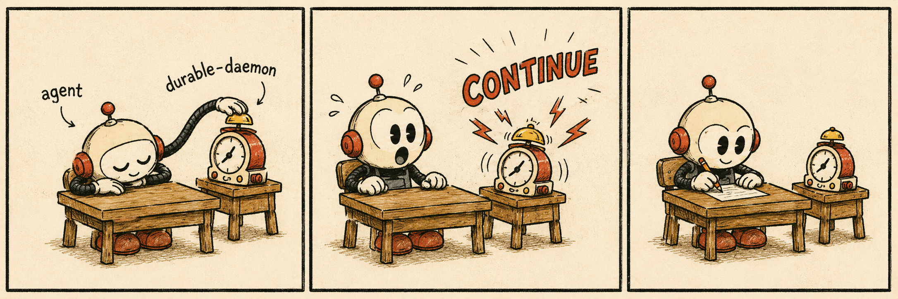

# Sleepy Agent

**Install once. Then your agent can take a nap anywhere.**



Sleepy Agent lets Codex start a long job, stop polling, and wake up in the same
task when it is time to continue.

```text
You:   Download this 80 GB dataset, verify it, then preprocess it.
Codex: Starts the download.
       I’ll continue here automatically when it finishes, fails, or times out.

       [No model polling while the local daemon waits]
       Injected message: continue

Codex: Verifies the download and starts preprocessing.
```

## Design philosophy

Start the job. Take a nap. Wake up in the same task. Continue.

No queues, dashboards, orchestration, or model-side polling. Just one durable
wait and one plain message:

```text
continue
```

## Install

Sleepy Agent is currently macOS-first and Codex-first. It requires Python 3.10+
and a Codex version with `codex queue`.

```bash
git clone https://github.com/Shadow-Alex/sleepy-agent.git
cd sleepy-agent
./scripts/install_local.sh
```

That installs both the Skill and its local daemon. No `sudo` is required.

## Use

Use Codex normally. You never need to invoke Sleepy Agent by name.

```text
Run the full backtest and summarize it when it finishes.

Train the model, then evaluate the best checkpoint.

Build the production image, then run the smoke tests.
```

When waiting is the only work left, the agent can nap. The local daemon watches
a read-only completion condition without model turns, then sends `continue` to
the original task.

## Install from skills.sh

```bash
npx skills add Shadow-Alex/sleepy-agent \
  --skill sleepy-agent --agent codex --global --yes
```

This installs the Skill instructions only. Use the full installer above for the
required local daemon.

## Maintenance

```bash
durable-continue doctor
durable-continue list
durable-continue cancel <monitor-id>
./scripts/uninstall_local.sh
```

The internal runtime keeps the stable `durable-continue` name so existing
daemon and state paths do not need a risky migration.

Sleepy Agent runs locally, opens no network listener, collects no telemetry, and
does not broaden Codex permissions. Wake delivery is crash-safe and
duplicate-resistant, but strict exactly-once delivery is not claimed.

Sleepy Agent is an independent open-source project. It is not affiliated with
or endorsed by OpenAI.

[MIT License](LICENSE)
