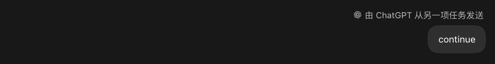

# Sleepy Agent

**Install once. Then your Codex agent can take a nap anywhere.**

[](https://github.com/Shadow-Alex/sleepy-agent/releases/latest)
[](https://www.skills.sh/shadow-alex/sleepy-agent/sleepy-agent)


Sleepy Agent lets Codex start a long job, stop spending model turns on polling,
and wake up in the same task when the job succeeds, fails, or reaches its hard
timeout.

```text
You:   Download this 80 GB dataset, verify it, then preprocess it.
Codex: Starts the download and registers one read-only completion check.
       The active turn ends while a local LaunchAgent waits.

       [No model polling]
       [No second Codex server]
       [No window switching]

Codex Desktop sends: continue
Codex: Verifies the download and starts preprocessing.
```

## What the wake-up looks like

The wake-up is an ordinary user message delivered to the original task, even
while you are working in another one:



## Why v0.4 is different

Earlier releases used `codex queue`. That command could start a transient
headless App Server and report queue acceptance before Codex Desktop had
actually consumed the message. In practice, a queued `continue` could remain
invisible until the user reopened the target task.

Sleepy Agent v0.4 removes that path completely. There is now one thread writer:
the App Server already owned by Codex Desktop.

- A macOS LaunchAgent runs only bounded, read-only checker commands and updates
  a private SQLite state file.
- A Sleepy Agent plugin process is launched by Codex Desktop and inherits the
  app's authenticated native tool pipe.
- The dispatcher can call only `codex_app.send_message_to_thread`, for the
  registered task ID, with the fixed prompt `continue`.
- Delivery never focuses a window, changes conversations, reads the composer,
  clicks a button, or uses macOS Accessibility automation.
- If Desktop is closed or the plugin is not loaded, the monitor remains
  `DELIVERY_PENDING` until a Desktop-owned dispatcher becomes available.

Before sending, the dispatcher records the target rollout's byte offset. It
accepts success only after observing an exact new `continue` after that offset
and recording the resulting turn ID. If Desktop accepted the message but the
dispatcher lost the response, the next attempt adopts the already-visible
message instead of sending a duplicate. Transient failures back off; archived
or invalid targets open a terminal circuit breaker.

```text
WAITING -> CHECKING -> DELIVERY_PENDING -> DELIVERING -> DELIVERED
                    \-------------------------------> CANCELLED
```

## Install or upgrade

Prerequisites:

- macOS
- a current Codex Desktop build with local plugin support
- the `codex` CLI
- Python 3.10 or newer

```bash
git clone https://github.com/Shadow-Alex/sleepy-agent.git
cd sleepy-agent
./scripts/install_local.sh
```

For an existing clone:

```bash
git pull --ff-only
./scripts/install_local.sh
```

The installer stops the old checker before migration, installs the runtime
under `~/.codex/durable-continue`, installs the public `sleepy-agent` skill,
registers the local Desktop plugin, migrates the SQLite database
transactionally, and restarts the read-only checker LaunchAgent. No `sudo` is
required.

Start a new Codex task once after installation or upgrade so Desktop loads the
dispatcher plugin.

## Use

Use Codex normally. You do not need to invoke Sleepy Agent by name.

```text
Run the full backtest and summarize it when it finishes.

Train the model, then evaluate the best checkpoint.

Build the production image, then run the smoke tests.
```

After the long-running process survives a bounded startup check and waiting is
the only work left, Codex can register:

```bash
durable-continue register \
  --check '<read-only command>' \
  --success '<regex>' \
  --failure '<optional regex>' \
  --timeout 8h \
  --interval 10m
```

The checker may observe an existing PID, log, marker file, scheduler or relay
ID, process query, or SSH status command. It must never mutate, retry, or
resubmit the underlying job.

## Install from skills.sh

```bash
npx skills add Shadow-Alex/sleepy-agent \
  --skill sleepy-agent --agent codex --global --yes
```

This installs the agent instructions only. Durable delivery also requires the
CLI, LaunchAgent, and Desktop plugin installed by `./scripts/install_local.sh`.
The skill intentionally refuses to emulate delivery when that runtime is
missing.

## Diagnose and remove

```bash
durable-continue doctor
durable-continue status <monitor-id>
durable-continue list
durable-continue cancel <monitor-id>
./scripts/uninstall_local.sh
```

Uninstalling preserves the durable state database by default. Pass `--purge`
only when you also want to remove that state.

The internal CLI and state directory retain the `durable-continue` name so
existing installations can upgrade without a risky state-path migration.

Sleepy Agent runs locally, opens no network listener, collects no telemetry,
and does not broaden Codex permissions. It is an independent open-source
project and is not affiliated with or endorsed by OpenAI.

[MIT License](LICENSE)
